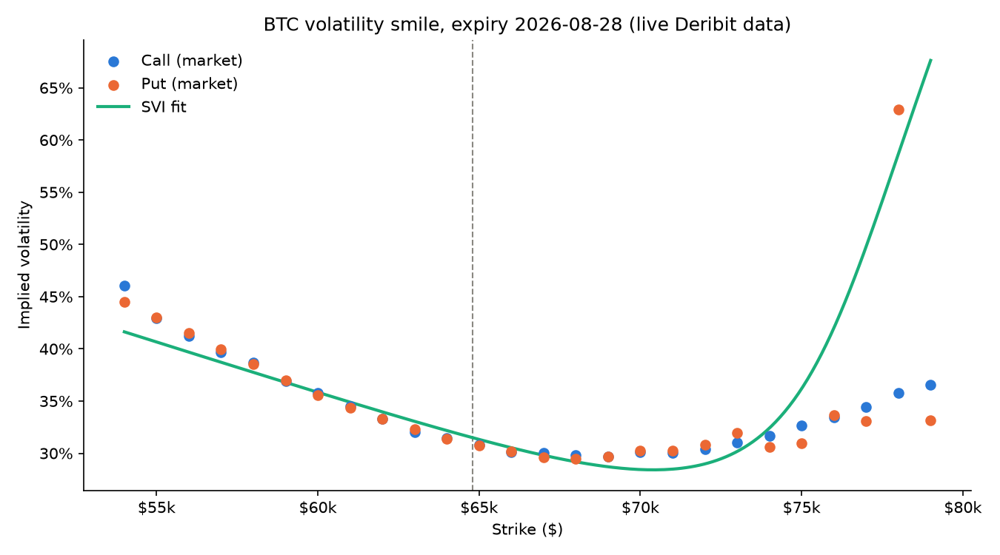
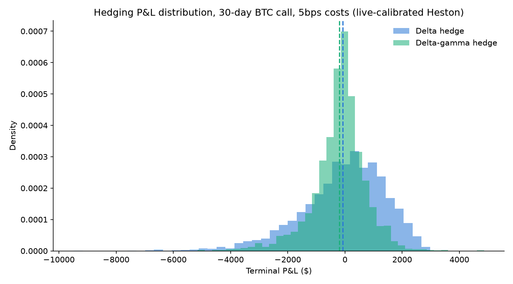

# VolLab

Crypto options don't behave the way Black-Scholes says they should. Pull up
any BTC or ETH chain on Deribit and the volatility smile is far more
extreme than anything you'd see in equities. Deep out-of-the-money puts get
priced tens of vol points above at-the-money, skew flips around macro
events, and the term structure never really settles down because these
things trade 24/7 with no weekend for realized vol to cool off.

Black-Scholes assumes one constant volatility per underlying. The market
clearly disagrees: every strike and expiry gets priced with its own implied
vol. This project is my attempt to model that properly. Fit the actual
surface, price options consistently across it, and then get to the more
interesting question: once you have a realistic model of how the surface
moves, can a neural network hedge an option book better than classic delta
hedging, once real trading costs are in the picture?



Real BTC implied vols pulled live from Deribit, with the SVI curve fit
through them. Generated by `scripts/plot_smile.py`.

## The plan

**Ingestion.** Pull live option chains from Deribit. Already built, see
below.

**Surface.** Fit each expiry's smile with SVI (Gatheral's parameterization,
five numbers that describe an entire smile shape), then stitch expiries
together into one arbitrage-free surface with SSVI. Deribit quotes option
premiums in BTC or ETH, not USD, which is its own headache. Everything has
to be converted through the index price before any of this math is usable.

**Pricing.** SVI gives you a smile, but it's just curve-fitting. It can't
price something that doesn't already trade, like a barrier option. That
needs an actual stochastic process. Heston is the standard choice:
volatility itself follows a random, mean-reverting process correlated with
the spot. The catch is Heston has no closed form except through a
characteristic-function integral, and it's easy to implement subtly wrong
in a way that still spits out plausible-looking numbers. So every price
gets computed two independent ways, the Fourier/COS method and Monte
Carlo, and they have to agree within a few standard errors. If they don't,
something's broken.

**Hedging.** The actual point of all this. Once you can simulate realistic
surface dynamics (or replay historical ones), does a neural network trained
to minimize hedging risk, "deep hedging" per Buehler et al. (2019), actually
beat plain delta or delta-gamma hedging once transaction costs are in the
picture? Textbook theory says perfect hedging is free and continuous. Real
markets charge you every time you trade. See Results below for what a
real backtest actually shows for delta vs delta-gamma; the deep-hedging
side of that comparison is still ahead of me, see What's actually built.

## What's actually built

All four tiers exist end to end, with one deliberate exception (the
deep-hedging loss function, see below). `DeribitClient` pulls live
option chains straight from Deribit's public market data API. No
account, no API key needed, it's just open. Every quote gets validated
into a strict `OptionQuote` model (strikes have to be positive, bids
can't be negative, expiries have to be in the future), and prices get
converted from crypto-denominated to USD using each contract's index
price at snapshot time, so nothing downstream has to think about
"0.012 BTC" as an option premium.

On top of that: `ForwardEstimator` recovers each expiry's forward price
and discount factor straight from put-call parity. `ImpliedVolSolver`
inverts Black-76 to pull implied vol out of a real market price.
`SVICalibrator` fits a smooth 5-number curve through the resulting smile
(that's the chart above). `ArbitrageChecker` actually proves whether that
curve is arbitrage-free, rather than assuming it (it isn't always -- see
the notes in `svi_calibrator.py`, that's a real, known limitation, not a
bug). `SurfaceStore` saves all of it as a time series.

For pricing: `COSPricer` prices Heston options via a Fourier-cosine
expansion; `MonteCarloPricer` prices the same contracts by literally
simulating thousands of possible futures. They exist specifically to
check each other, and in testing, they do -- every price in
`scripts/check_cross_checker.py` agrees within one standard error.
`HestonCalibrator` fits Heston's own 5 parameters to a real market
surface (targeting the fitted SVI curves, not raw noisy quotes) using
`COSPricer` inside the same kind of weighted least squares as
`SVICalibrator`.

For hedging: `HestonSimulator` generates risk-neutral price paths from
calibrated Heston parameters; `BootstrapSimulator` generates real-world
paths instead, by block-resampling a genuine year of BTC's own historical
returns, so a strategy can be checked against actual market behavior, not
just Heston's own assumptions about itself. `DeltaHedger` and
`DeltaGammaHedger` hedge a short option position using Greeks computed
straight from `COSPricer`; `HedgeBacktester` runs either one over
simulated paths with proportional transaction costs and reports the
resulting P&L distribution. See Results below for what that actually
shows.

`DeepHedger` (a small trained network) and `DeepHedgerTrainer` (a fully
differentiable simulate-hedge-and-backprop training loop) are both built
and verified working end to end, right up to one deliberately unfinished
piece: the training objective itself (a CVaR risk measure of terminal
P&L) is left for me to write by hand, not handed to me finished --
`DeepHedgerTrainer.loss()` documents exactly what's needed and points at
the Rockafellar-Uryasev formulation as a starting point.

`SPEC.md` has the full design, including a couple of scope notes on
pieces that turned out smaller than originally sketched (the P&L
attribution breakdown, mainly) once real backtesting made clear what was
actually worth building first.

## Results

The headline experiment SPEC.md sketched: backtest delta hedging against
delta-gamma hedging at 0/5/10bps transaction costs, on a 30-day BTC call,
using paths simulated from a real, live-calibrated Heston surface (3,000
paths, rehedging every 1.5 days). `scripts/run_headline_experiment.py`
runs it; deep hedging isn't in this comparison yet, since its loss
function is still the one open piece (see What's actually built).

| Strategy    | Costs | Mean P&L  | Std P&L  | CVaR95    | Total costs |
|-------------|------:|----------:|---------:|----------:|------------:|
| Delta       |  0bps |    -33.97 | 1,493.28 | -3,672.11 |         0.00 |
| Delta       |  5bps |   -109.48 | 1,498.54 | -3,763.21 |   226,523.28 |
| Delta       | 10bps |   -184.99 | 1,504.06 | -3,854.89 |   453,046.55 |
| Delta-gamma |  0bps |   -135.43 |   941.98 | -2,684.39 |         0.00 |
| Delta-gamma |  5bps |   -209.93 |   934.39 | -2,754.30 |   223,492.22 |
| Delta-gamma | 10bps |   -284.43 |   933.30 | -2,837.35 |   446,984.45 |



Delta-gamma cuts P&L standard deviation by about 37% and meaningfully
improves CVaR95 (the average loss in the worst 5% of outcomes) at every
cost level, visible directly in the chart as a noticeably tighter
distribution. But its mean P&L is worse than plain delta hedging's at
every cost level too, including the frictionless 0bps case. That's a
real finding, not noise: delta-gamma is actively trading a second
instrument (a fixed 5%-out-of-the-money option) every single rehedge, and
that extra trading carries its own discretization drag even before real
transaction costs are switched on. Risk reduction has a cost. This is
exactly the tradeoff gamma hedging is supposed to make, just made
concrete with real numbers instead of asserted.

Total transaction costs scale almost exactly linearly with the spread,
for both strategies, which is the correct sanity check on `CostModel`
itself working as designed.

## Running it

```bash
uv pip install -e ".[dev]"
python scripts/run_deribit.py
```

No credentials needed, it only touches Deribit's public endpoints. It'll
print a real, live BTC option chain. `scripts/` has a `check_*.py` for
every other class in the project, each running against real live data;
`scripts/plot_smile.py` and `scripts/plot_hedge_pnl.py` regenerate the
two charts above, and `scripts/run_headline_experiment.py` regenerates
the results table (takes a few minutes; it's pricing thousands of paths
with COSPricer, not a quick call).

For code quality: `ruff check .` and `mypy src/ scripts/`, also run in CI
on every push via `.github/workflows/ci.yml`. There's no automated test
suite by design. For a project like this, actually running the thing and
reading real output catches more than a green checkmark does.
